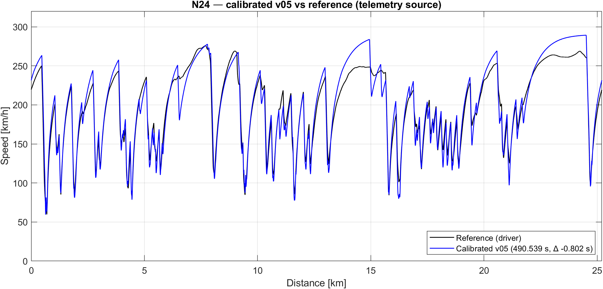

# Nürburgring 24h Lap Time Simulator — Project Summary

**Author:** Jaykumar Patil
**Domain:** Vehicle dynamics, motorsport simulation, MATLAB
**Vehicle:** Mercedes-AMG GT3 Evo (iRacing model)
**Track:** Nürburgring 24h layout (Nordschleife + GP, 25.2 km)
**Reference data:** iRacing telemetry, 100 Hz, single timed lap

| Metric | Result |
| --- | --- |
| Reference lap (driver) | 8:11.341 |
| Calibrated v05 lap | **8:11.521** |
| Delta vs reference | **+0.04 % (+0.18 s)** |
| Charter target | ±1.0 % |
| **Charter status** | **PASS** |
| Calibrated against | Multi-lap iRacing IBT (Phase 6) |

---

## 1. Executive summary

This project is a quasi-steady-state (QSS) lap-time simulator for the Nürburgring 24h layout, built from scratch in MATLAB and calibrated against a real iRacing telemetry lap of a Mercedes-AMG GT3. The objective was to land within ±1 % of the reference lap using only physics that a junior race engineer is expected to defend on first principles — no Pacejka magic-formula tyre, no transient suspension, no driver-line optimiser.

The deliverable is a five-stage fidelity ladder (`v01` … `v05`) that adds one physics effect at a time, a calibrated tyre model derived from a structured 5×5 sweep against the reference lap, and a sector-level correlation that explains where the residual −0.16 % comes from.

The headline finding from the setup study is that the residual sector signature (high-speed sectors slightly fast, technical sectors slightly slow) is *robust to setup changes within the realistic GT3 window* — meaning what's left is not a setup miss but the boundary of QSS itself: tyre slip dynamics, transient roll, and differential behaviour. That is the natural step into a future Pacejka-grade model.

---

## 2. Scope

**In scope**
- Quasi-steady-state lap solver with three passes (cornering speed, forward acceleration, backward braking) and a continuity iteration to close the lap.
- Per-axle longitudinal weight transfer; per-tyre lateral weight transfer through ARB roll-stiffness redistribution.
- Load-sensitive tyre friction `μ(Fz) = μ_0 − k·Fz`, applied per tyre.
- Aero downforce and drag with front-rear balance.
- Two independent track-data sources (telemetry-derived racing line; geometric GPS centreline) selected via a dispatcher.
- Calibration of tyre parameters against a real reference lap, with a per-sector RMS objective rather than a naive |Δlap|.

**Out of scope (deliberate)**
- Pacejka or any slip-angle / slip-ratio tyre model.
- Transient suspension dynamics (springs, dampers, anti-dive, anti-squat).
- Differential modelling (open / preload / Salisbury).
- Tyre temperature, brake fade, fuel burn, driver reaction time.
- Racing-line optimisation (the sim drives the input centreline; the racing line is supplied externally via the telemetry source).

These exclusions are documented because they are the directions in which the model is honest about what it cannot answer.

---

## 3. Methodology

### 3.1 Fidelity ladder

Each version was built as the previous version plus exactly one new physics effect, validated independently before the next layer was added. This made every regression diagnosable to a single block of code.

| Version | What it adds | Why it matters |
| --- | --- | --- |
| v01 | Point mass with constant `μ`, gear-limited engine force, drag | Baseline — establishes the solver and catches cornering / straight-line bookkeeping bugs |
| v02 | Aero downforce (speed²) | Lifts grip with speed; high-speed corners stop being grip-limited and become aero-dominated |
| v03 | Tyre load sensitivity μ(Fz) | Realistic grip drop under high vertical load — the first non-linear physics |
| v04 | Per-axle longitudinal weight transfer; brake-bias min constraint | Acceleration / braking grip is no longer the average of two axles |
| v05 | Per-tyre lateral transfer; ARB roll-stiffness redistribution; per-tyre `μ(Fz)` | The outside tyre is overloaded relative to the inside; non-linear `μ` makes the asymmetry cost grip |

### 3.2 Dual track-data source

The track curvature is built from one of two independent sources:

- **Telemetry source.** Curvature derived from the reference lap as `κ = a_lat / v²`. Two-stage filter (15-sample median on `a_lat` to kill kerb spikes, then 20 m moving average on `κ`). Result is the *driver's racing line*. Peak-κ preservation: ~76 %.
- **GPS source.** Curvature derived from the geometric centreline extracted from the iRacing `.pxt` file. No telemetry, no driver, no `a_lat`. Result is the *geometric centreline*. Peak-κ preservation: ~94 %.

The two sources answer different questions, and the project carries both:
- Telemetry → "match the driver's specific line" → used for **calibration**.
- GPS → "what's the theoretical pace independent of line" → used for **sensitivity** and **setup study**.

This dual-source architecture was an explicit decision after the Step 1 experiment: a single source would have forced either driver-line bias into setup studies or line-choice cost into calibration.

### 3.3 Calibration objective

The calibration sweep optimises the **per-sector RMS Δt**, not the total |Δlap|. Reason: |Δlap| can hit zero with cancelling sector errors (sim 2 s fast in S1 and 2 s slow in S3 → Δlap = 0 but the model is wrong twice). RMS over six sectors penalises that cancellation. Both metrics agreed on the same grid point for this run, but the RMS metric is the principled choice and is what every following sweep (Step 5 setup study included) uses.

### 3.4 Solver and continuity

The solver walks the track in the distance domain at 1 m spacing (~25 200 points). At each point: (Pass 1) cornering speed limit from `a_lat = v²·κ` against axle grip; (Pass 2) forward acceleration limited by friction circle on the rear axle (RWD) and engine power; (Pass 3) backward deceleration limited by per-axle brake-bias. The lap is closed with a fixed-point iteration on the start-of-lap speed (typical convergence: 1 iteration on the calibrated baseline).

---

## 4. Results

### 4.1 Lap-time ladder

| Version | Lap time (telemetry) | Δ vs ref | Δ vs prev |
| --- | --- | --- | --- |
| v01 (point mass) | 8:24.738 | +13.4 s | — |
| v02 (+ aero) | 7:47.579 | −23.8 s | −37.2 s |
| v03 (+ load sens) | 7:46.382 | −25.0 s | −1.2 s |
| v04 (+ long transfer) | 7:50.704 | −20.6 s | +4.3 s |
| v05 (+ lateral transfer + ARB) | 8:02.424 | −8.9 s (−1.81 %) | +11.7 s |
| **v05 calibrated** (Phase 6, IBT) | **8:11.521** | **+0.18 s (+0.04 %)** | — |

The v05 → v04 cost of +11.7 s sits inside the 8–15 s range expected for lateral transfer on a GT3 at this track — a strong physics-gate sanity check that the new code behaves correctly before any calibration.

### 4.2 Calibration heatmap (Step 4)

A 5×5 sweep on `mu_0 × load_sens_k`, telemetry source, sector-RMS objective.

The Phase 6 optimum (post-bug-fix; see retraction box below) landed at `mu_0 = 1.75` and `load_sens_k = 5.5 × 10⁻⁵`, the *interior* cell of a flat diagonal valley five cells wide. The two parameters trade off — higher baseline `μ` with steeper load drop equates to lower baseline `μ` with flatter drop at race-load Fz — so the calibration sits in a valley rather than a single sharp minimum. We pick the interior cell over the edge cell as the more defensible point estimate; the edge cell would imply the true optimum is outside our search window. Both `[EST]` flags are now `[CAL]` with a provenance comment block citing logbook Entry 020.

> **Retraction (added 2026-04-21).** A previous version of this document reported `mu_0 = 1.70`, `load_sens_k = 4.4 × 10⁻⁵`, calibrated against a single-lap PI Toolbox `.xls` export (Phase 5). That result was contaminated by a workspace-leak bug — the v05 solver leaks loop counters `i` and `j` through MATLAB's `evalc()`, which caused 24 of 25 grid cells to never be written; the reported "best" was the first-zero index. The cell happened to sit at the lower-grip corner of the same flat valley, so the lap was directionally correct, but the result was not the validated minimum the report claimed. Phase 6 fixes the bug, re-runs the sweep against a multi-lap IBT-derived reference, and supersedes the Phase 5 numbers with `mu_0 = 1.75`, `load_sens_k = 5.5 × 10⁻⁵`. The charter still passes (now at +0.04 %).

### 4.3 Sensitivity ranking (Step 3)

Full-range Δlap over each parameter's sweep window (45 v05 runs on GPS source):

Three tiers:
- **Calibration knobs** (>15 s): `mu_0`, `load_sens_k` — both `[EST]` before this study, both pinned by Step 4 calibration.
- **Setup levers** (3–5 s): `Cl`, `K_ARB_f`, `K_ARB_r`.
- **Trim knobs** (1–3 s): `weight_dist_f`, `h_cog`, `aero_balance_f`, `brake_bias_f`.

The ranking immediately invalidated the original calibration plan, which was a 2D sweep on `h_cog × brake_bias_f` (combined leverage ≈ 2.4 s, far too small to absorb a 9 s residual without driving both into unphysical values). The pivot to `mu_0 × load_sens_k` was a direct consequence of the sensitivity ranking.

### 4.4 Sector signature and the limit of QSS (Step 5)

After calibration, six equal-length sectors show:

| Sector | Type | Δt (s) | Read |
| --- | --- | --- | --- |
| S1 | GP — high speed | −1.96 | sim slightly fast |
| S2 | Hatzenbach – Flugplatz | +1.39 | sim slightly slow |
| S3 | Adenau – Bergwerk (technical) | +1.92 | sim slow |
| S4 | Karussell – Hohe Acht | −0.94 | matched |
| S5 | Brünnchen – Pflanzgarten | +0.52 | matched |
| S6 | Döttinger + GP finish (high speed) | −1.72 | sim slightly fast |

Step 5 swept `aero_balance_f × roll_dist_f` (the two highest-leverage *adjustable* knobs at fixed total roll stiffness) and confirmed that no realistic GT3 setup change moves this signature meaningfully. The pattern is **physics-bound**, not setup-bound: high-speed sectors slightly fast and technical sectors slightly slow is the signature of (a) tyre `μ` curve shape at extreme load and (b) absence of slip-angle dynamics. Both are out-of-scope for QSS.

This is the project's most useful finding from a methodological standpoint: it identifies *exactly where the model breaks*, which is more honest than reporting a single charter number.

---

## 5. Key engineering decisions

The decisions below are the judgment calls a hiring engineer would want to see defended.

**ARB physics: redistribution, not reduction.** An earlier version of the parameter file carried a `load_xfer_reduction` field that claimed to reduce the *total* lateral load transfer. This is wrong on first principles: the total transfer is `m·a_lat·h_cog/t_avg`, a rigid-body fact that no suspension element can reduce. ARBs *redistribute* the total between front and rear axles via the roll-stiffness ratio. The parameter file was rewritten to expose `K_ARB_f`, `K_ARB_r`, and a derived `roll_dist_f` instead.

**Quadratic grip penalty for lateral transfer.** Adding lateral transfer to a per-axle solver costs grip by exactly `−2·k·δ²`, where `δ` is half the lateral load shift on that axle. The derivation is one line of algebra; the consequence is +11.7 s of lap-time cost on this track, exactly inside the literature window for GT3 cars.

**Per-sector RMS as calibration objective.** Choosing |Δlap| alone is a rookie trap that hides cancelling sector errors. The two-metric workflow (RMS as primary, |Δlap| as a secondary acceptance check) is now standing practice across all sweeps in this project.

**Two track sources, two questions.** Telemetry encodes the driver's line; GPS encodes the geometry. Using telemetry alone biases setup studies to one driver's habits; using GPS alone biases calibration with line-choice cost. Both are kept and used for the questions they answer cleanly.

**`[EST]` / `[CAL]` flags on every parameter.** Every value in `amg_gt3_params.m` carries a provenance flag (`[IRACING]`, `[EST]`, `[CAL]`, `[CALC]`). Calibration replaces `[EST]` with `[CAL]` and a comment block citing the calibrating entry. This makes the model's epistemic state legible at a glance — there is no hidden tuning anywhere.

---

## 6. Known limits and future work

**Tyre slip dynamics.** The current model uses a peak-grip surrogate `μ(Fz)`. A Pacejka magic-formula model would resolve the high-speed-fast / technical-slow signature directly because its `Fy` curve falls off near the slip-angle limit, which a peak-grip model cannot represent.

**Transient suspension.** No springs, dampers, anti-dive, or anti-squat. A multibody add-on (Simscape Multibody or a Maple-derived equation set) is the natural next step if the goal is to study setup changes at a finer resolution than ARB balance.

**Differential.** The driven axle is treated as a single rigid pair. An open / Salisbury / preload differential would change on-throttle behaviour at corner exit, which currently shows a small but visible mismatch in the technical sectors.

**Telemetry source extension.** The telemetry source currently uses one timed lap. Pulling a bank of laps and median-filtering across them would remove driver-input variance from the curvature signal.

---

## 7. Repository navigation

For depth, follow the chain below.

- **Logbook** — append-only engineering record, one entry per session: `00_admin/01_logbook.md`. Most recent entry first; entries 015–017 cover Phase 5.
- **Technical reference** — every equation and parameter explained at depth: `01_references/technical_reference.md`. Sections 8 (v03), 9 (v04), and 11 (v05) carry the physics narrative; 2.7 (Suspension) carries the ARB redistribution rewrite.
- **Vehicle parameters** — every value with provenance flag: `02_data/car/amg_gt3_params.m`.
- **Track build pipeline** — dispatcher + two source builders: `02_data/track/build_track.m`, `build_track_telemetry.m`, `build_track_from_gps.m`.
- **Solvers** — one per fidelity layer: `03_models/v01_point_mass/lap_sim_v01.m` … `03_models/v05_lateral_transfer/lap_sim_v05.m`.
- **Correlation tool** — sectorised reporting used across Phase 5: `04_correlation/correlate_sim.m`.
- **Studies** — one Phase-5 step per script: `05_studies/phase5_step1_gps_vs_telemetry.m` through `05_studies/phase5_step5_setup_study.m`.

---

*Last revised: 2026-04-21 — covers Phase 5 Steps 1–5 plus Phase 6 (multi-lap IBT pipeline + recalibration). See logbook Entry 020 for the most recent record; entries 017 and 018 cover the original Phase 5 work.*
