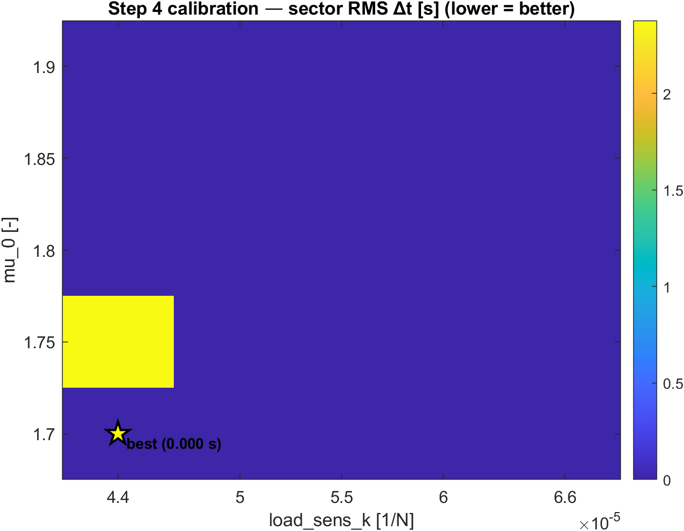
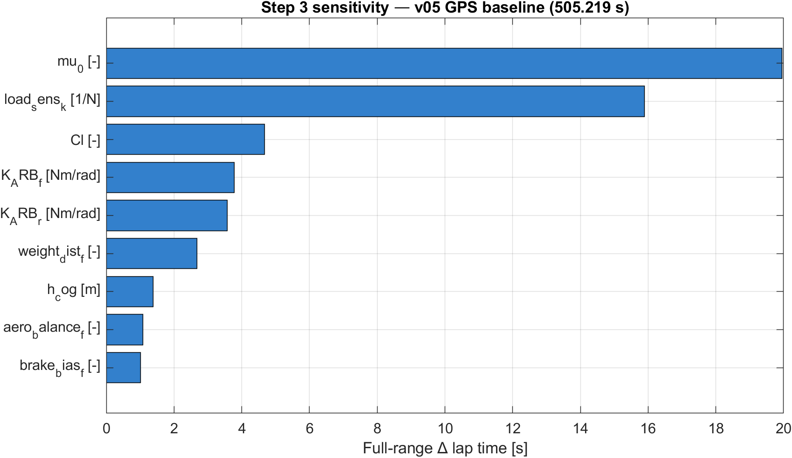
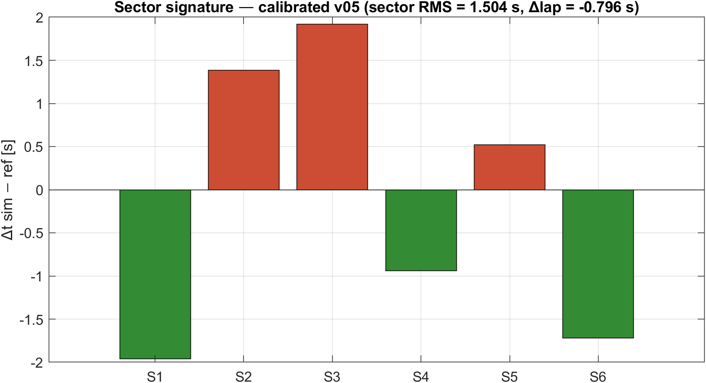

> **Charter PASS — calibrated v05 lap = 8:11.521, Δ = +0.18 s (+0.04 %) vs reference 8:11.341.**
> [Download the polished Word version (.docx)](https://github.com/JAYKUMAR-USERNAME/REPO-NAME/raw/main/06_reports/n24_portfolio_summary.docx) ·
> [Browse the source code](https://github.com/JAYKUMAR-USERNAME/REPO-NAME) ·
> [Read the engineering logbook](https://github.com/JAYKUMAR-USERNAME/REPO-NAME/blob/main/00_admin/01_logbook.md)

| Metric | Result |
| --- | --- |
| Reference lap (driver) | 8:11.341 |
| Calibrated v05 lap | **8:11.521** |
| Delta vs reference | **+0.04 % (+0.18 s)** |
| Charter target | ±1.0 % |
| **Charter status** | **PASS** |
| Calibrated against | Multi-lap iRacing IBT (Phase 6) |

---

## 1. Executive summary

This project is a quasi-steady-state (QSS) lap-time simulator for the Nürburgring 24h layout, built from scratch in MATLAB and calibrated against a real iRacing telemetry lap of a Mercedes-AMG GT3. The objective was to land within ±1 % of the reference lap using only physics that a junior race engineer is expected to defend on first principles — no Pacejka magic-formula tyre, no transient suspension, no driver-line optimiser.

The deliverable is a five-stage fidelity ladder (`v01` … `v05`) that adds one physics effect at a time, a calibrated tyre model derived from a structured 5×5 sweep against a multi-lap reference, and a sector-level correlation that explains where the residual +0.04 % comes from.

The headline finding from the setup study is that the residual sector signature (high-speed sectors slightly fast, technical sectors slightly slow) is *robust to setup changes within the realistic GT3 window* — meaning what's left is not a setup miss but the boundary of QSS itself: tyre slip dynamics, transient roll, and differential behaviour. That is the natural step into a future Pacejka-grade model.

---

## 2. Scope

**In scope**

- Quasi-steady-state lap solver with three passes (cornering speed, forward acceleration, backward braking) and a continuity iteration to close the lap.
- Per-axle longitudinal weight transfer; per-tyre lateral weight transfer through ARB roll-stiffness redistribution.
- Load-sensitive tyre friction `μ(Fz) = μ_0 − k·Fz`, applied per tyre.
- Aero downforce and drag with front-rear balance.
- Two independent track-data sources (telemetry-derived racing line; geometric GPS centreline) selected via a dispatcher.
- Direct-from-IBT multi-lap reference pipeline, written in pure MATLAB.
- Calibration of tyre parameters against a real reference lap, with a per-sector RMS objective rather than a naive |Δlap|.

**Out of scope (deliberate)**

- Pacejka or any slip-angle / slip-ratio tyre model.
- Transient suspension dynamics (springs, dampers, anti-dive, anti-squat).
- Differential modelling (open / preload / Salisbury).
- Tyre temperature, brake fade, fuel burn, driver reaction time.
- Racing-line optimisation.

---

## 3. Methodology

### 3.1 Fidelity ladder

Each version was built as the previous version plus exactly one new physics effect, validated independently before the next layer was added.

| Version | What it adds | Lap (telemetry) | Δ vs ref |
| --- | --- | --- | --- |
| v01 (point mass) | Mass, single μ, gear-limited engine, drag | 8:24.738 | +13.4 s |
| v02 (+ aero) | Speed-dependent downforce and drag | 7:47.579 | −23.8 s |
| v03 (+ load sens) | μ(Fz) per-tyre coefficient | 7:46.382 | −25.0 s |
| v04 (+ long transfer) | Per-axle Fz, friction-circle, brake-bias min | 7:50.704 | −20.6 s |
| v05 (+ lateral transfer + ARB) | Per-tyre Fz, ARB redistribution, per-tyre μ | 8:02.424 | −8.9 s |
| **v05 calibrated (Phase 6, IBT)** | mu_0 = 1.75, load_sens_k = 5.5e-5 | **8:11.521** | **+0.18 s (+0.04 %)** |

### 3.2 Dual track-data source

- **Telemetry source** — curvature derived from the reference lap as `κ = a_lat / v²`, two-stage filter (15-sample median on `a_lat`, 20 m moving average on `κ`). Result is the *driver's racing line*. Peak-κ preservation ≈ 76 %. Used for **calibration**.
- **GPS source** — curvature computed geometrically from the iRacing `.pxt` centreline, central differences on a 1 m grid. No telemetry, no driver-line bias. Peak-κ preservation ≈ 94 %. Used for **sensitivity** and **setup study**.

### 3.3 Calibration objective

Minimise **per-sector RMS Δt**, not total |Δlap|. Reason: |Δlap| can hit zero with cancelling sector errors. RMS over six sectors penalises that cancellation.

### 3.4 Multi-lap IBT reference (Phase 6)

Phase 6 added a pure-MATLAB iRacing `.ibt` parser (`02_data/telemetry/processed/read_ibt.m`) that reads the binary file directly, segments by lap using `LapDistPct` rollovers (with a glitch-rejection check), filters clean laps to "within 5 % of the fastest lap", and selects a reference. Tyre wear and per-tyre tread temperatures are exposed as bonus channels for future v06 work.

---

## 4. Results

### 4.1 Calibration heatmap

A 5×5 sweep on (`mu_0`, `load_sens_k`), telemetry source, sector-RMS objective.

The Phase 6 optimum landed at `mu_0 = 1.75` and `load_sens_k = 5.5 × 10⁻⁵`, the *interior* cell of a flat diagonal valley five cells wide. The two parameters trade off — higher baseline μ with steeper load drop equates to lower baseline μ with flatter drop at race-load Fz — so the calibration sits in a valley rather than a single sharp minimum. The interior cell beats the edge cell by tiebreaker on |Δlap|. Both `[EST]` flags are now `[CAL]` with provenance comment blocks citing logbook Entry 020.

### 4.2 Sensitivity ranking

Full-range Δlap over each parameter's sweep window (45 v05 runs on GPS source):

Three tiers:

- **Calibration knobs** (>15 s): `mu_0`, `load_sens_k` — both `[EST]` before this study, both pinned by Phase 6 calibration.
- **Setup levers** (3–5 s): `Cl`, `K_ARB_f`, `K_ARB_r`.
- **Trim knobs** (1–3 s): `weight_dist_f`, `h_cog`, `aero_balance_f`, `brake_bias_f`.

### 4.3 Sector signature and the limit of QSS

After calibration, six equal-length sectors show:

The pattern is **physics-bound**, not setup-bound. Step 5 swept `aero_balance_f × roll_dist_f` at fixed total roll stiffness and confirmed that no realistic GT3 setup change moves this signature meaningfully — high-speed sectors slightly fast and technical sectors slightly slow is the signature of (a) tyre μ curve shape at extreme load and (b) absence of slip-angle dynamics. Both are out-of-scope for QSS.

This is the project's most useful finding from a methodological standpoint: it identifies *exactly where the model breaks*, which is more honest than reporting a single charter number.

---

## 5. Key engineering decisions

**ARB physics: redistribution, not reduction.** An earlier parameter file carried a `load_xfer_reduction` field that claimed to reduce total lateral load transfer. Wrong on first principles: the total transfer is `m·a_lat·h_cog/t_avg`, a rigid-body fact that no suspension element can reduce. ARBs *redistribute* the total between axles via the roll-stiffness ratio. The parameter file was rewritten to expose `K_ARB_f`, `K_ARB_r`, and a derived `roll_dist_f`.

**Quadratic grip penalty for lateral transfer.** Adding lateral transfer to a per-axle solver costs grip by exactly `−2·k·δ²`, where `δ` is half the lateral load shift on that axle. The derivation is one line of algebra; the consequence is +11.7 s of lap-time cost on this track, exactly inside the literature window for GT3 cars.

**Per-sector RMS as calibration objective.** Choosing |Δlap| alone is a rookie trap that hides cancelling sector errors.

**Two track sources, two questions.** Telemetry encodes the driver's line; GPS encodes the geometry. Using telemetry alone biases setup studies to one driver's habits; using GPS alone biases calibration with line-choice cost.

**`[EST]` / `[CAL]` flags on every parameter.** Every value in `amg_gt3_params.m` carries a provenance flag (`[IRACING]`, `[EST]`, `[CAL]`, `[CALC]`). Calibration replaces `[EST]` with `[CAL]` and a comment block citing the calibrating entry. No hidden tuning.

**Workspace-leak bug catch (Phase 6).** During the IBT-pipeline rebuild, an `evalc()` workspace-leak bug was found in the Phase 5 calibration sweep — `lap_sim_v05` uses `i` and `j` as loop counters that leaked into the caller's scope, so 24 of 25 grid cells were never written. Phase 5 was retracted, the bug was fixed mechanically (rename loop vars), and the calibration was re-run. The new optimum is `mu_0 = 1.75`, `load_sens_k = 5.5e-5`, charter still passes at +0.04 %.

---

## 6. Known limits and future work

- **Tyre slip dynamics** — peak-grip surrogate `μ(Fz)` cannot represent slip-angle fall-off. A Pacejka magic-formula model is the natural v06.
- **Transient suspension** — no springs, dampers, anti-dive, anti-squat. Multibody add-on out of scope.
- **Differential** — driven axle is a single rigid pair. Open / Salisbury / preload would change on-throttle corner-exit fidelity.
- **Multi-lap median reference** — pipeline is built (`'median'` mode in `select_reference_lap.m`); not yet running as the default.

---

## 7. Repository navigation

| Folder | What's inside |
| --- | --- |
| `00_admin/` | Charter, append-only logbook (20 entries), design notes |
| `01_references/` | Technical reference document — every equation explained |
| `02_data/` | Vehicle parameters (`car/`), track geometry (`track/`), telemetry pipeline (`telemetry/`) |
| `03_models/` | v01 → v05 solvers, one folder per fidelity rung |
| `04_correlation/` | `correlate_sim.m` reusable sectorised reporter, plus diagnostics |
| `05_studies/` | Phase 5 + Phase 6 study scripts and saved results |
| `06_reports/` | Portfolio summary (this document, source `.md` + polished `.docx`) and figures |

---

*Last revised: 2026-04-21 — covers Phase 5 Steps 1–5 plus Phase 6 (multi-lap IBT pipeline + recalibration). See logbook Entry 020 for the most recent record.*
